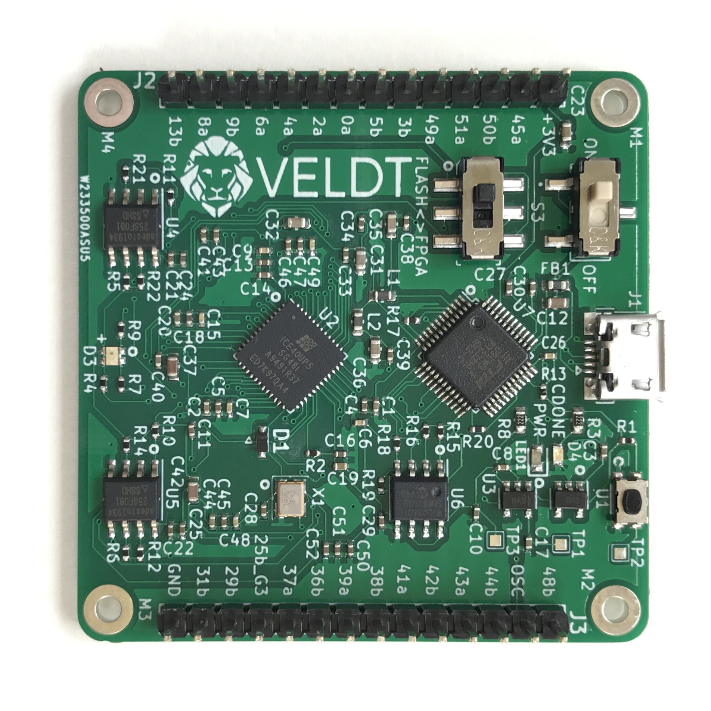
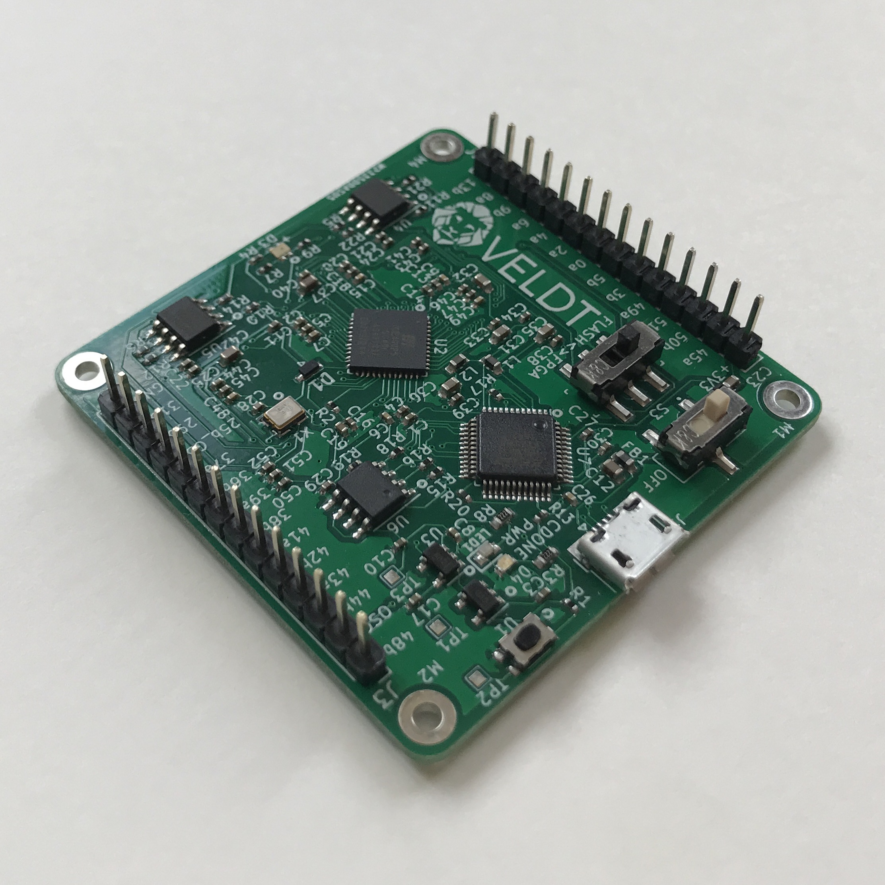
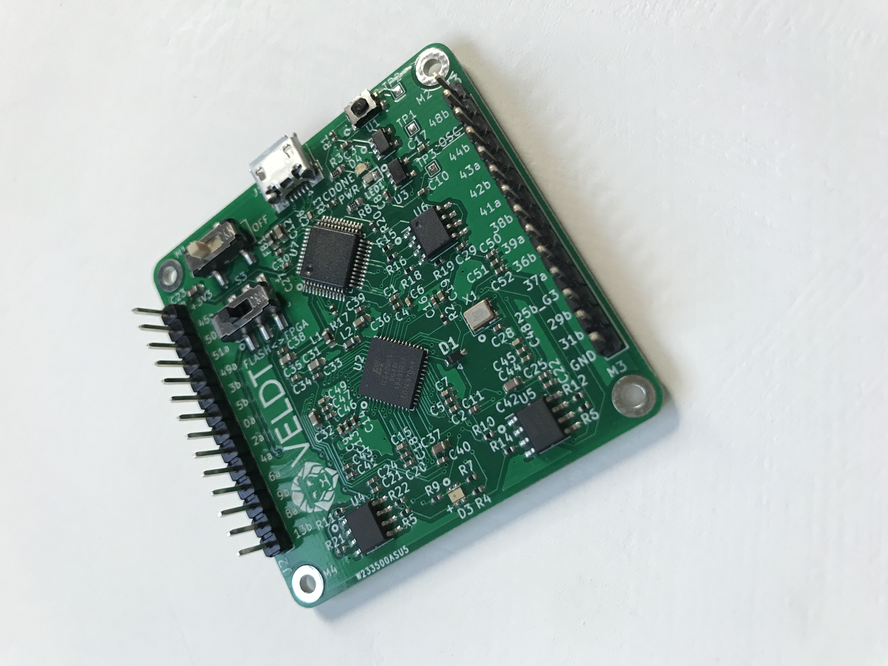
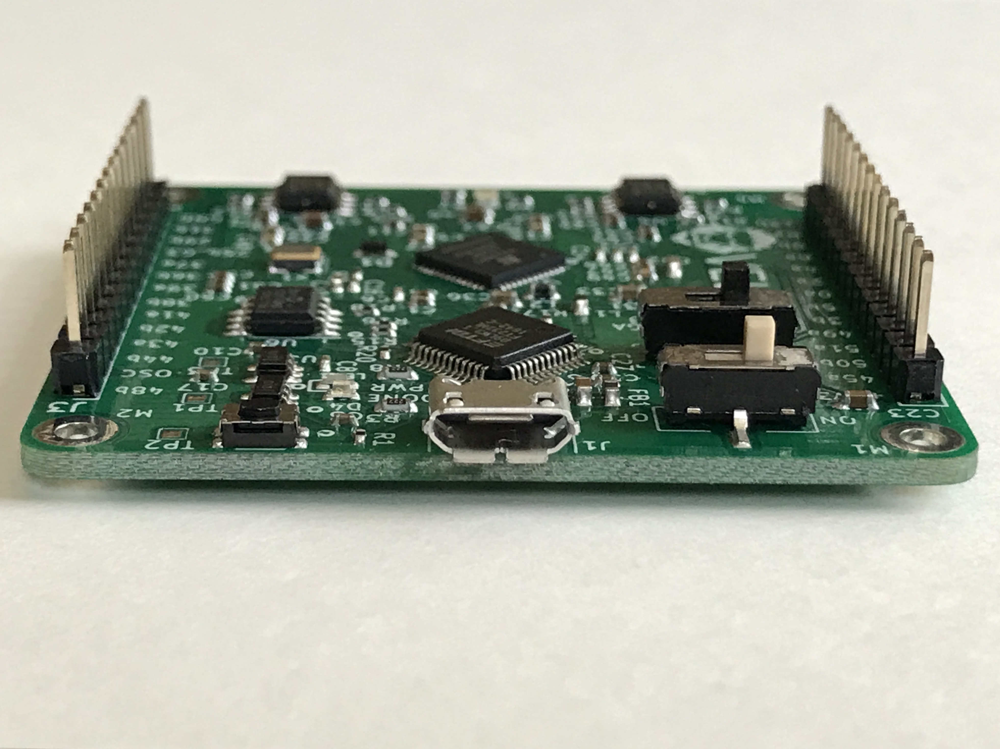
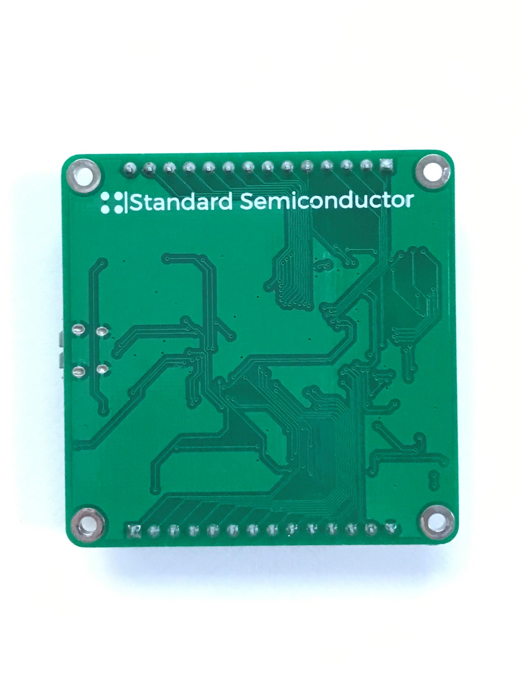
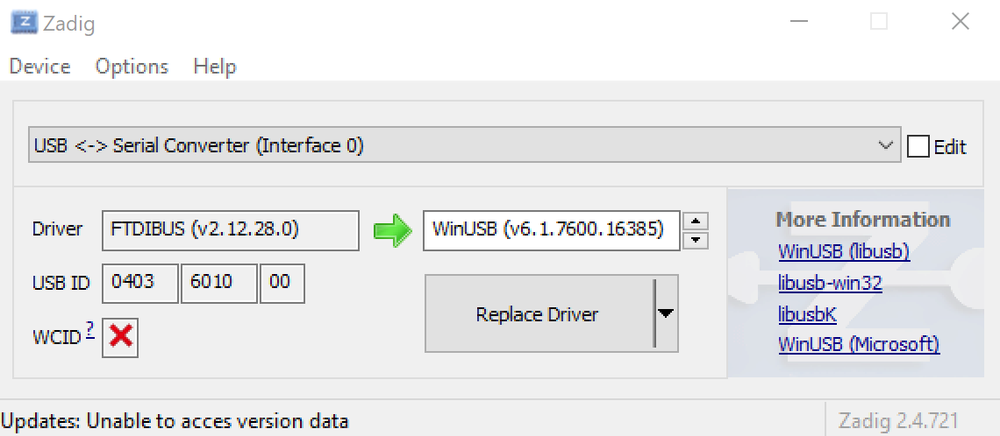

# VELDT-info
VELDT Gallery, Datasheets &amp; Documentation

## Table of Contents
1. [Gallery](#gallery)
2. [Functional Diagram](#functional-diagram)
3. [PCB Datasheets and Dimensions](#pcb-datasheets-and-dimensions)
4. [FPGA](#fpga) 
   1. [Data Sheets](#data-sheets)
   2. [Pin Mapping](#pin-mapping)
5. [Flash](#flash)
6. [FTDI](#ftdi)
7. [Development Tools](#development-tools)
   1. [Project IceStorm](#project-icestorm)
      1. [Install Project IceStorm from Source on Ubuntu](#install-project-icestorm-from-source-on-ubuntu)
      2. [Update Project IceStorm from Source on Ubuntu](#update-project-icestorm-from-source-on-ubuntu)
      3. [Using Project IceStorm Flow](#using-project-icestorm-flow)
   2. [Lattice](#lattice)
      1. [Radiant](#radiant)
      2. [iCECube2](#icecube2)
   3. [Clash](#clash)
      1. [Clash on Ubuntu](#clash-on-ubuntu)
   4. [Mane (Beta)](#mane-beta)
      1. [Install Mane from Source on Windows](#install-mane-from-source-on-windows)
      
**Clicking on any header within this document will return to Table of Contents.**
## [Gallery](#table-of-contents)

<details>
<summary>Main</summary>


</details>

<details>
<summary>Angle right</summary>


</details>

<details>
<summary>Angle</summary>


</details>

<details>
<summary>Side</summary>


</details>

<details>
<summary>Back</summary>


</details>

## [Functional Diagram](#table-of-contents)
[VELDT Functional Diagram PDF](functional-diagram.pdf)

The main functional components of VELDT are:
1. [FPGA](#fpga)
2. [Flash](#flash)
3. [FTDI](#ftdi)

## [PCB Datasheets and Dimensions](#table-of-contents)
[VELDT Dimensions](veldt_board-dims.svg)

[Pin Header Datasheet](pin-header-datasheet.pdf): [Mouser Product Detail](https://www.mouser.com/ProductDetail/Wurth-Elektronik/61301411121?qs=%2Fha2pyFaduhMmJnB02gxA5ABCVoTu2iJ%252BCdO9DvZHAyBLbCBkJOwig%3D%3D)

## [FPGA](#table-of-contents)
### [Data Sheets](#table-of-contents)
[iCE40 UltraPlus Product Page](https://www.latticesemi.com/en/Products/FPGAandCPLD/iCE40UltraPlus)

[iCE40 UltraPlus Family Data Sheet PDF](FPGA-DS-02008-1-9-iCE40-UltraPlus-Family-Data-Sheet.pdf)

[iCE40 LED Driver Usage Guide PDF](ICE40LEDDriverUsageGuide.pdf)

[DSP Function Usage Guide PDF](DSPFunctionUsageGuideforICE40Devices.pdf)

[iCE40 sysCLOCK PLL Design and Usage Guide PDF](iCE40sysCLOCKPLLDesignandUsageGuide.pdf)

[iCE40 Oscillator Usage Guide](FPGA-TN-02008-1-7-iCE40-Oscillator-Usage-Guide.pdf)

[iCE40 SPRAM Usage Guide PDF](FPGA-TN-02022-1-2-iCE40-SPRAM-Usage-Guide.pdf)

[ICE Technology Library PDF](SBTICETechnologyLibrary201708.pdf)

[Advanced SPI and I2C Usage Guide PDF](AdvancediCE40SPII2CHardenedIPUsageGuide.pdf)

### [Pin Mapping](#table-of-contents)
[PDF Version](iCE40UltraUltraPlusSG48PinMigration.pdf)

[XLSX Excel Version](iCE40UP-5k-Pinout.xlsx)
FNC|Pin Type|Bank|Differential Pair|ICE40UP-5K-SG48
---|--------|----|-----------------|---------------
IOB_0a|DPIO|2|TRUE_of_IOB_1b|46
IOB_2a|DPIO|2|TRUE_of_IOB_3b|47
IOB_3b_G6|DPIO/GBIN|2|COMP_of_IOB_2a|44
IOB_4a|DPIO|2|TRUE_of_IOB_5b|48
IOB_5b|DPIO|2|COMP_OF_IOB_4a|45
IOB_6a|DPIO|2|TRUE_of_IOB_7b|2
IOB_8a|PIO|2|TRUE_of_IOB_9b|4
IOB_9b|PIO|2|COMP_of_IOB_8a|3
creset_b|CONFIG|1||8
IOB_13b|PIO|1||6
CDONE|CONFIG|1||7
IOB_16a|PIO|1||9
IOB_18a|PIO|1||10
IOB_20a|PIO|1||11
IOB_22a|PIO|1|TRUE_of_IOB_23b|12
IOB_23b|PIO|1|COMP_of_IOB_22a|21
IOB_24a|PIO|1||13
IOB_25b_G3|PIO/GBIN|1||20
IOB_29b|PIO|1||19
IOB_31b|DPIO|1|COMP_of_IOB_30a|18
IOB_32a_SPI_WO|PIO/CONFIG_SPI|1||14
IOB_33b_SPI_WI|PIO/CONFIG_SPI|1||17
IOB_34a_SPI_WCK|PIO/CONFIG_SPI|1||15
IOB_35b_SPI_WS|PIO/CONFIG_SPI|1||16
IOT_36b|PIO|0|COMP_of_IOT_37a|25
IOT_37a|PIO|0|TRUE_of_IOT_36b|23
IOT_38b|PIO|0|COMP_of_IOT_39a|27
IOT_39a|PIO|0|TRUE_of_IOT_38b|26
IOT_41a|PIO|0||28
IOT_42b|PIO|0|COMP_of_IOT_43a|31
IOT_43a|PIO|0|TRUE_of_IOT_42b|32
IOT_44b|PIO|0|COMP_of_IOT_45a|34
IOT_45a_G1|PIO/GBIN|0|TRUE_of_IOT_44b|37
IOT_46b_G0|PIO/GBIN|0||35
IOT_48b|PIO|0|COMP_of_IOT_49a|36
IOT_49a|PIO|0|TRUE_of_IOT_48b|43
IOT_50b|PIO|0|COMP_of_IOT_51a|38
IOT_51a|PIO|0|TRUE_of_IOT_50b|42
RGB2|LED|0||41
RGB1|LED|0||40
RGB0|LED|0||39
VCC|VCC|VCC||5
VCC|VCC|VCC||30
VCCIO_0|VCCIO|0||33
VCCIO_2|VCCIO|2||1
SPI_VCCIO_1|VCCIO|1||22
VCCPLL|VCCPLL|VCCPLL||29
VPP_2V5|VPP|VPP||24

## [Flash](#table-of-contents)
[AT25SF081 Data Sheet PDF](AT25SF081.pdf)

## [FTDI](#table-of-contents)
[FTDI FT232H Data Sheet PDF](DS_FT232H.pdf)

## [Development Tools](#table-of-contents)

### [Project IceStorm](#table-of-contents)
Visit the [Project IceStorm Homepage](https://yosyshq.net/icestorm) and the [Github Repository](https://github.com/YosysHQ/icestorm) for more information. Note all Project Icestorm tools will be installed relative to `/usr/local/`

####  [Install Project IceStorm from Source on Ubuntu](#table-of-contents)
1. Install Prerequisites:
```console
foo@bar:~$ sudo apt install build-essential clang bison flex libreadline-dev gawk tcl-dev libffi-dev git graphviz xdot pkg-config python python3 libftdi-dev qt5-default python3-dev libboost-all-dev cmake libeigen3-dev
```
2. Install [IceStorm Tools](https://github.com/YosysHQ/icestorm) (icepack, icebox, iceprog, icetime, chip databases, etc.):
```console
foo@bar:~$ git clone https://github.com/YosysHQ/icestorm.git icestorm
foo@bar:~$ cd icestorm
foo@bar:~/icestorm$ make -j$(nproc)
foo@bar:~/icestorm$ sudo make install
```
3. Install [NextPNR](https://github.com/YosysHQ/nextpnr) (place-and-route tool):
```console
foo@bar:~$ git clone https://github.com/YosysHQ/nextpnr nextpnr
foo@bar:~$ cd nextpnr
foo@bar:~/nextpnr$ git submodule update --init
foo@bar:~/nextpnr$ cmake -DARCH=ice40 -DCMAKE_INSTALL_PREFIX=/usr/local .
foo@bar:~/nextpnr$ make -j$(nproc)
foo@bar:~/nextpnr$ sudo make install
```
4. Install [Yosys](https://github.com/YosysHQ/yosys) (Verilog synthesis):
```console
foo@bar:~$ git clone https://github.com/YosysHQ/yosys.git yosys
foo@bar:~$ cd yosys
foo@bar:~/yosys$ git submodule update --init
foo@bar:~/yosys$ make -j$(nproc)
foo@bar:~/yosys$ sudo make install
```
5. Update [udev](https://wiki.debian.org/udev) rules:

Create a file `/etc/udev/rules.d/53-lattice-ftdi.rules` with the following line:
```
ATTRS{idVendor}=="0403", ATTRS{idProduct}=="6014", MODE="0660", GROUP="plugdev", TAG+="uaccess"
```
This will allow uploading bitstreams as unprivileged user.

The installation is complete.

#### [Update Project IceStorm from Source on Ubuntu](#table-of-contents)
1. Update [IceStorm Tools](https://github.com/YosysHQ/icestorm):
```console
foo@bar:~$ cd icestorm
foo@bar:~/icestorm$ git pull
foo@bar:~/icestorm$ make -j$(nproc)
foo@bar:~/icestorm$ sudo make install
```
2. Update [NextPNR](https://github.com/YosysHQ/nextpnr):
```console
foo@bar:~$ cd nextpnr
foo@bar:~/nextpnr$ git pull
foo@bar:~/nextpnr$ git submodule update
foo@bar:~/nextpnr$ cmake -DARCH=ice40 -DCMAKE_INSTALL_PREFIX=/usr/local .
foo@bar:~/nextpnr$ make -j$(nproc)
foo@bar:~/nextpnr$ sudo make install
```
3. Update [Yosys](https://github.com/YosysHQ/yosys):
```console
foo@bar:~$ cd yosys
foo@bar:~/yosys$ git pull
foo@bar:~/yosys$ git submodule update
foo@bar:~/yosys$ make -j$(nproc)
foo@bar:~/yosys$ sudo make install
```

The update is complete.

#### [Using Project IceStorm Flow](#table-of-contents)

1. Synthesize Verilog Source Files:
```console
foo@bar:~/test$ ls
Baz.v Top.v
foo@bar:~/test$ yosys -p  "synth_ice40 -top Top -json Top.json -dsp -abc2" Top.v Baz.v
foo@bar:~/test$ ls
Baz.v Top.json Top.v
```
Step 1 assumes the top module is named "Top" and located in `Top.v`. `-json` writes the synthesized design to the specified JSON file. `-dsp` means Yosys will use iCE40 UltraPlus DSP cells for large arithmetic. Finally, the `-abc2` switch causes Yosys to run two passes of `abc` for slightly improved logic density. See the [Yosys Homepage](https://yosyshq.net/yosys/) and [Github Repository](https://github.com/YosysHQ/yosys) for more information. For up-to-date help and reference use `yosys -h` and `yosys -h synth_ice40`.

2. Place and Route Design:
```console
foo@bar:~/test$ nextpnr-ice40 --up5k --package sg48 --pcf Top.pcf --asc Top.asc --json Top.json
foo@bar:~/test$ ls
Baz.v Top.asc Top.json Top.v
```
For more information about NextPNR see the [Github Repository](https://github.com/YosysHQ/nextpnr), [Project IceStorm Homepage](https://yosyshq.net/icestorm) and `nextpnr-ice40 -h`.

3. Pack and Program Bitstream:
```console
foo@bar:~/test$ icepack Top.asc Top.bin
foo@bar:~/test$ ls
Baz.v Top.asc Top.bin Top.json Top.v
foo@bar:~/test$ iceprog Top.bin
```
### [Lattice](#table-of-contents)
Visit the [Lattice Website](https://latticesemi.com) for more information.

#### [Radiant](#table-of-contents)
Visit the [Lattice Radiant Software](https://www.latticesemi.com/Products/DesignSoftwareAndIP/FPGAandLDS/Radiant) page for downloads and documentation.

#### [iCECube2](#table-of-contents)
Visit the [Lattice iCECube2 Software](https://www.latticesemi.com/iCEcube2) page for downloads and documentation.

### [Clash](#table-of-contents)
Visit the [Clash Website](https://clash-lang.org), [Github Repository](https://github.com/clash-lang/clash-compiler), and [Hackage Documentation](http://hackage.haskell.org/package/clash-prelude) for more information.

#### [Clash on Ubuntu](#table-of-contents)
1. Install Haskell using [GHCup](https://www.haskell.org/ghcup/)
2. Update PATH:
```console
foo@bar:~$ echo "export PATH=\$PATH:\$HOME/.ghcup/bin" >> .bashrc
foo@bar:~$ . .bashrc
foo@bar:~$ which ghc && which cabal
/home/foo/.ghcup/bin/ghc
/home/foo/.ghcup/bin/cabal
foo@bar:~$ ghc --version && cabal --version
The Glorious Glasgow Haskell Compilation System, version yyy
cabal-install version xxx
compiled using version xxx of the Cabal library
```
3. Update Cabal:
```console
foo@bar:~$ cabal update
```

4. Verify Clash:
```console
foo@bar:~$ git clone https://github.com/standardsemiconductor/VELDT-blinker-clash.git
foo@bar:~$ cd VELDT-blinker-clash/
foo@bar:~/VELDT-blinker-clash$ cabal run clash --write-ghc-environment-files=always -- Blinker --verilog
foo@bar:~/VELDT-blinker-clash$ ls verilog/Blinker/Blinker/
Blinker.manifest Blinker.v
```

**Step 4 may fail due to Clash not currently supporting the latest GHC version.**

If this happens, try an older GHC version using `ghcup tui`.

### [Mane (Beta)](#table-of-contents)

[Mane](https://github.com/standardsemiconductor/mane) is the open-source tool for loading bitstreams onto VELDT. It is maintained by Standard Semiconductor to ensure optimized performance with VELDT. Visit the [Github Repository](https://github.com/standardsemiconductor/mane) for more information. Please [open an issue](https://github.com/standardsemiconductor/mane/issues) if you have any problems, questions, or suggestions. 

#### [Install Mane from Source on Windows](#table-of-contents)
**The following steps should be run as Administrator on Powershell.** (Right click, `Run as Administrator`)
1. [Install Chocolatey](https://chocolatey.org/install)
   
   **You may need to shut down and restart powershell prior to using `choco`.**
2. Install [Haskell](https://www.haskell.org/platform/windows.html):
   ```powershell
   C:\Users\foo> choco install haskell-dev
   C:\Users\foo> refreshenv
   C:\Users\foo> cabal update
   ```
3. Install [libusb](https://libusb.info):
   
   **You may need to shut down and restart powershell prior to using `mingw64-pkg`**

   <details>
   <summary><b>You may need to use a new msys2-keyring package</b></summary>
   <p>
   
   [From MSYS2 News (2020-06-29)](https://www.msys2.org/news/):
   > We have released a new msys2-keyring package from that source (and a new installer that includes them) and we are waiting for a bit before uploading new databases and packages to give people time to update. If you don't update the keyring in time, you'll see something like this:
   
   ```
   :: Synchronizing package databases...
   downloading mingw32.db...
   downloading mingw32.db.sig...
   error: mingw32: key "4A6129F4E4B84AE46ED7F635628F528CF3053E04" is unknown
   :: Import PGP key 4096R/87771331B3F1FF5263856A6D974C8BE49078F532, "David Macek <david.macek.0@gmail.com>", created: 2018-01-14? [Y/n]
   error: mingw32: signature from "David Macek <david.macek.0@gmail.com>" is marginal trust
   error: failed to update mingw32 (invalid or corrupted database (PGP signature))

   downloading mingw64.db...
   downloading mingw64.db.sig...
   error: mingw64: signature from "David Macek <david.macek.0@gmail.com>" is marginal trust
   error: failed to update mingw64 (invalid or corrupted database (PGP signature))

   downloading msys.db...
   downloading msys.db.sig...
   error: msys: signature from "David Macek <david.macek.0@gmail.com>" is marginal trust
   error: failed to update msys (invalid or corrupted database (PGP signature))
   error: failed to synchronize all databases

   error: mingw32: signature from "David Macek <david.macek.0@gmail.com>" is marginal trust
   error: mingw64: signature from "David Macek <david.macek.0@gmail.com>" is marginal trust
   error: msys: signature from "David Macek <david.macek.0@gmail.com>" is marginal trust
   ```
   > We have prepared the following steps to verify and install the new keyring manually after which you should be able to use `pacman -Syu` again:

   ```
   $ curl -O http://repo.msys2.org/msys/x86_64/msys2-keyring-r21.b39fb11-1-any.pkg.tar.xz
   $ curl -O http://repo.msys2.org/msys/x86_64/msys2-keyring-r21.b39fb11-1-any.pkg.tar.xz.sig

   $ pacman-key --verify msys2-keyring-r21.b39fb11-1-any.pkg.tar.xz.sig
   ==> Checking msys2-keyring-r21.b39fb11-1-any.pkg.tar.xz.sig... (detached)
   gpg: Signature made Mon Jun 29 07:36:14 2020 CEST
   gpg:                using DSA key AD351C50AE085775EB59333B5F92EFC1A47D45A1
   gpg: Good signature from "Alexey Pavlov (Alexpux) <alexpux@gmail.com>" [full]

   # pacman -U msys2-keyring-r21.b39fb11-1-any.pkg.tar.xz
   ```

   > If you can't even import the key and the above command fails like this:

   ```
   error: msys: key "4A6129F4E4B84AE46ED7F635628F528CF3053E04" is unknown
   :: Import PGP key 4A6129F4E4B84AE46ED7F635628F528CF3053E04? [Y/n]
   [...]
   error: database 'msys' is not valid (invalid or corrupted database (PGP signature))
   loading packages...
   error: failed to prepare transaction (invalid or corrupted database)
   ```

   > ... you have to convince pacman to not care about those databases for a while, for example like this:

   ```
   # pacman -U --config <(echo) msys2-keyring-r21.b39fb11-1-any.pkg.tar.xz
   ```

   > If you still see signature errors, resetting your pacman key store might help:

   ```
   # rm -r /etc/pacman.d/gnupg/
   # pacman-key --init
   # pacman-key --populate msys2
   ```

   </p>
   </details>

   Use `mingw64-pkg` to install libusb:
   ```powershell
   C:\Users\foo> mingw64-pkg install libusb
   ```
   1. Copy `C:\tools\msys64\mingw64\bin\libusb-1.0.dll` to `C:\Windows\System32\`.
   2. Open `C:\Users\foo\AppData\Roaming\cabal\config` in a text editor. Find the line containing `extra-include-dirs`, add `C:\tools\msys64\mingw64\include\libusb-1.0`.
   3. Find the line containing `extra-lib-dirs`, add `C:\tools\msys64\mingw64\bin`.
   
   **Make sure to delete the `--` and separate elements in the list with a comma.**
   ```
   ...
   extra-include-dirs: C:\tools\msys64\mingw64\include,
                       C:\tools\msys64\mingw64\include\libusb-1.0
   -- deterministic:
   -- cid:
   extra-lib-dirs: C:\tools\msys64\mingw64\bin
   ...
   ```
4. Update Drivers:
   
   Plug in VELDT, then install [Zadig](https://zadig.akeo.ie):
   ```powershell
   C:\Users\foo> choco install zadig
   C:\Users\foo> zadig
   ```
   In Zadig, select `Options` -> `List All Devices`. In the dropdown box select `USB <-> Serial Converter (Interface 0)`. On the `Driver` input, select the Up/Down arrows to choose `WinUSB` then click `Replace Driver` button. Close Zadig when the driver installation completes.
   
5. Install [Mane](https://github.com/standardsemiconductor/mane):
   
   **You may need to shut down and restart powershell prior to using `git`**
   ```powershell
   C:\Users\foo> choco install git
   C:\Users\foo> git clone https://github.com/standardsemiconductor/mane.git
   C:\Users\foo> cd .\mane\
   C:\Users\foo\mane> cabal install
   ```
6. Verify Mane:
   ```powershell
   C:\Users\foo\mane> mane .\example\Blinker.bin
   ```
